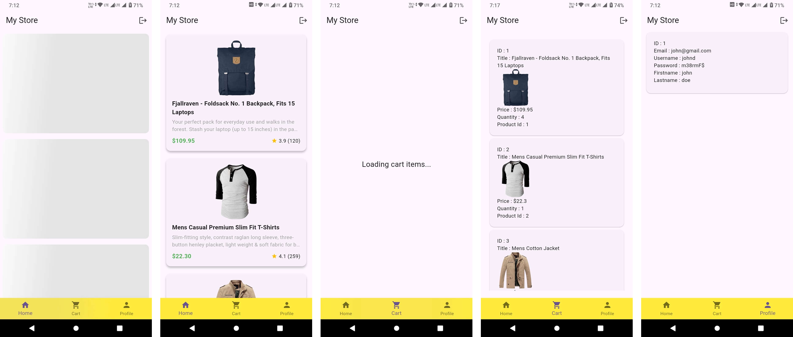

# API Practice App

A Flutter project designed to practice API integration and state management. The app features user authentication, product browsing, cart management, and user profiles.

## Features

- **Authentication**: User login using JWT tokens.
- **Dashboard**: Navigation between Home, Cart, and Profile screens.
- **Product Listing**: Fetch and display products from an API.
- **Cart Management**: View user's cart items (fetched via API).
- **User Profile**: View user details.
- **State Management**: Uses `setState` and `SharedPreferences` for session persistence.


## Screenshots


<p align="center">
  
</p>

## Tech Stack

- **Flutter**: UI toolkit.
- **http**: For making API requests.
- **shared_preferences**: For local storage (persisting user sessions).
- **jwt_decoder**: For decoding JWT tokens to extract user IDs.
- **flutter_screenutil**: For responsive UI adaptation.
- **shimmer**: For loading effects.

## Project Structure

```
lib/
├── core/           # Constants and services (Auth, API)
├── model/          # Data models (JSON serialization)
├── presentation/   # UI Screens (Login, Home, Cart, Profile)
├── utils/          # Utilities (SharedPrefs, Snackbars)
└── widgets/        # Reusable UI components
```

## Getting Started

1. **Clone the repository**:
   ```bash
   git clone https://github.com/milanrnw/API_PRACTICE.git
   ```

2. **Install dependencies**:
   ```bash
   flutter pub get
   ```

3. **Run the app**:
   ```bash
   flutter run
   ```

## Note

This project is for educational purposes to demonstrate API integration patterns in Flutter.
